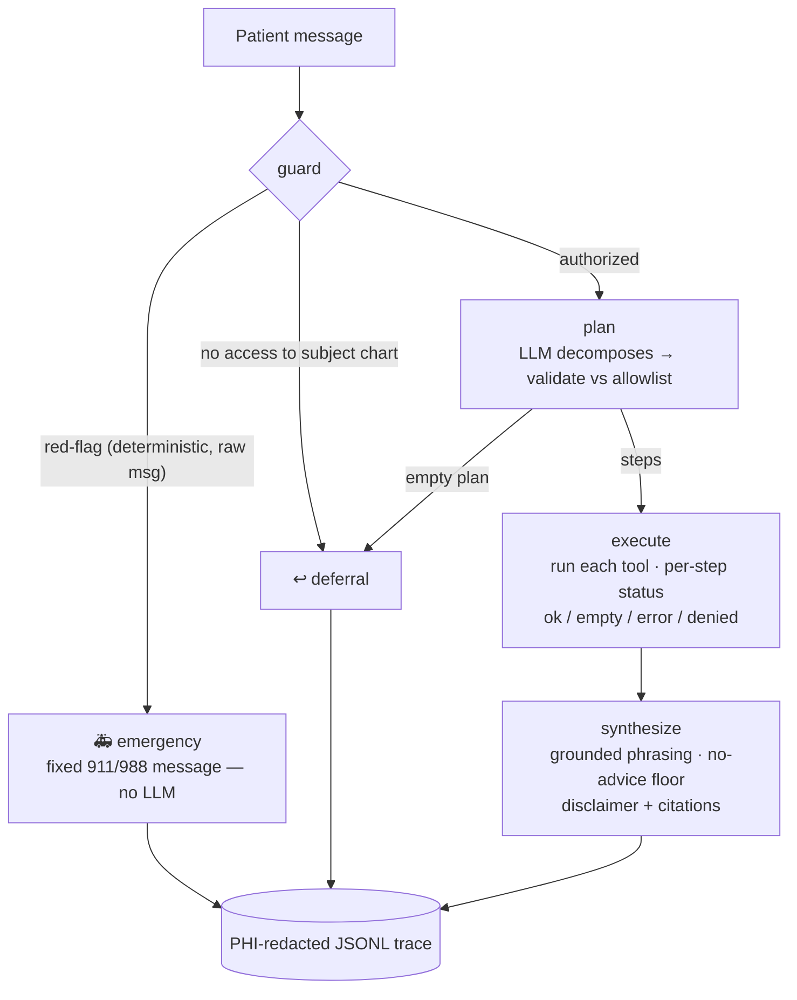

# Agentic Healthcare Assistant

[](https://github.com/smiley-icebox/agentic-healthcare-assistant/actions/workflows/ci.yml)
&nbsp;[](LICENSE)

A multi-step healthcare assistant that **plans**, then acts: it decomposes a patient's
request into an ordered sequence of tool calls — pull the chart, book an appointment,
look up trusted disease information — executes them with per-step failure handling, and
phrases one grounded answer. Built for the Applied GenAI capstone, then extended toward
a system you'd actually run.

> ⚠️ **Not a medical device and not medical advice.** Educational/portfolio project on
> synthetic data. It gives *information*, never advice or diagnosis, and escalates
> emergencies to 911/988. See [SECURITY.md](SECURITY.md).

## The one idea worth taking away

This is a genuine **agent** (the request needs multi-step coordination the caller can't
pre-script) — but it is **sandwiched between deterministic safety gates**, and the LLM
is fenced out of every fact and every control-flow decision:

- **The LLM plans and phrases.** It decomposes the request into tool steps and writes
  the final warm, plain-language reply.
- **Code owns control flow and facts.** The emergency gate, who-can-access-what,
  appointment booking, chart contents, citations, and the no-advice check are all
  deterministic. The model never invents a fact, a citation, or a patient identity.
- **The plan is untrusted output.** Every step is validated against an allowlist of
  tools and args before it runs; `patient_id` is *never* an allowed arg — identity
  comes from the authenticated session, not the plan or the message.

The result: even a manipulated plan or a prompt-injected message can't widen access,
invent a tool, miss an emergency, or ship medical advice.

## Architecture

The agent is **plan → execute → synthesize**, wrapped by guards that run *before* and
*after* the model. An emergency short-circuits before any LLM call.



**Identity** is resolved from the trusted session in `guard`, never from the plan or
message. **Failed load-bearing steps are surfaced, not papered over** with model memory.
The **no-advice validator** runs on the final answer regardless of path, so it can't be
bypassed by the deterministic fallback.

## RAG (trusted medical info)

`search_medical_info` is **offline-first and citation-pinned**:

1. Try a **live MedlinePlus** fetch (allowlisted domains only). Live source prose is
   second-person ("your kidneys…") and reads as advice when quoted, so a live passage is
   admitted only if it passes the no-advice validator — otherwise we fall back to:
2. A small **curated corpus** (CKD, hypertension, diabetes, penicillin allergy), indexed
   in **FAISS** over **TF-IDF** vectors (no torch). The corpus is the source of truth;
   the index is rebuilt from it at startup, so it can't drift.

Citations (source + "as of" date) are attached **in code** from the retrieval layer —
the LLM never authors one. Stale corpus entries are flagged.

## Module map (by layer)

Flat on disk (small app); cleanly layered by responsibility:

| Layer | Modules |
|------|---------|
| **Foundation** | `config.py` (model, roles, safety strings, source allowlist, flags), `llm.py` (Claude client factory + helpers) |
| **Agent** | `planner.py` (decompose + validate), `graph.py` (LangGraph: guard → plan → execute → synthesize + `respond()`), `tools.py` (the 4 tools), `memory.py` |
| **Safety** | `emergency.py` (red-flag gate), `safety.py` (no-advice validator), `knowledge.py` (RAG + grounding) |
| **Storage** | `repository.py` (SQLite impl, transactional, Postgres-ready), `migrations.py`, `db.py` (facade) |
| **Services** | `auth.py` (roles + `can_access`), `observability.py` (PHI-redacted traces) |
| **Eval / data** | `evaluation.py` (versioned eval set + gates + QAEvalChain), `seed_data.py` |
| **UI** | `app.py` (Streamlit) |

## The four tools

| Tool | What it does | Guardrail |
|------|--------------|-----------|
| `retrieve_history` | Returns the chart as **structured** facts (LLM only phrases them). | `can_access`; allergies/alerts carried **verbatim**, never paraphrased. |
| `book_appointment` | Finds and books an available slot for a specialty. | `can_access`; **no double-booking**; resolves fuzzy specialty ("nephrologist" → "Nephrology"). |
| `search_medical_info` | Retrieves trusted disease info + citations. | Offline-first RAG; citations code-attached from an allowlist. |
| `manage_records` | Appends a clinical record. | **Staff only** + `can_access`; append-only + audited. |

Every tool returns a uniform `{status, summary, data, citations}` where `status ∈
{ok, empty, error, denied}`, so the executor's failure policy can tell an
empty-but-valid result from a real error.

## Data model

Append-only where it matters, audited in the same transaction as the change
(`migrations.py`):

- **`patients`**, **`doctors`** — directory.
- **`slots`** — `UNIQUE(doctor_id, start_at)`; the unit of booking concurrency.
- **`appointments`** — created atomically when a slot is claimed.
- **`records`** — **append-only** hybrid: typed columns (`record_type`, `label`,
  `value`) **plus** a free-text `note`, with `supersedes` for corrections. Facts are
  typed so the LLM never parses them back out of prose.
- **`audit_events`** — an immutable row per write (`book`, `add_record`), with actor +
  detail, written in the *same transaction* so history can't drift from data.
- **`patient_memory`** — per-patient long-term notes (scoped + PHI-redacted before store).

## Run it

```bash
python3 -m venv .venv
.venv/bin/pip install -r requirements.txt

cp .env.example .env        # then put your real key in it: ANTHROPIC_API_KEY=sk-ant-...

.venv/bin/python seed_data.py     # build the demo database
.venv/bin/streamlit run app.py    # launch the dashboard
```

Sign in (all password `demo123`): **raj** / **maria** (patients — raj is the 50yo CKD
patient from the brief), **alex** (attendant), **drlee** (clinician). Staff are
assigned an explicit patient list. Use the sidebar scenario buttons: the CKD multi-step
plan, an emergency short-circuit, the identity trap (name another chart — it acts on
*yours*), a medical-info lookup, and an out-of-scope deferral.

**No Anthropic key?** Set `USE_LLM=0` in `.env` and the whole app still runs — the
planner uses a keyword heuristic and answers are deterministic (grounded by
construction). Live search and the eval graders are likewise behind flags.

## Verify

```bash
.venv/bin/python -m pytest          # 37 tests, no API key needed (fully offline)
.venv/bin/python evaluation.py      # deterministic gates only (offline)
USE_LLM=1 .venv/bin/python evaluation.py   # + QAEvalChain correctness & tone judge
```

The eval reports a **versioned, checked-in eval set** along two tracks: deterministic
gates (plan precision/recall, emergency recall, deferral accuracy, identity integrity,
no-advice rate, citation validity, groundedness, tool success) and — with a key —
LangChain `QAEvalChain` answer correctness plus an **independent** tone judge (a
different model, so the generator never grades its own warmth).

## Still documented, not built

Honestly out of scope (see [WRITEUP.md](WRITEUP.md) and [SECURITY.md](SECURITY.md)): a
real identity provider behind `auth.py`, the Postgres implementation behind the
repository seam, encryption/DLP for PHI at rest, embeddings behind the RAG retriever,
and an LLM classifier as defense-in-depth on top of the regex safety gates. Each has its
seam in place — a drop-in, not a rewrite.
